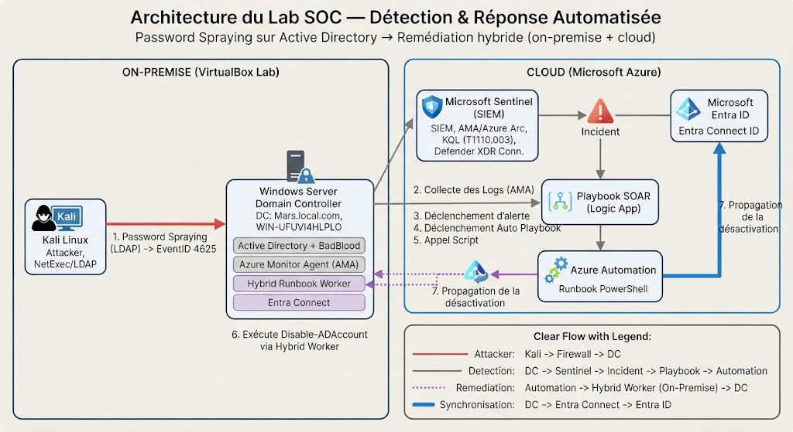

# 🛡️ Projet SOC — Détection & Réponse Automatisée à une Attaque Active Directory

**Document complet — tout le projet en un seul fichier**

Un home lab où j'ai monté une chaîne SOC complète : détecter une attaque **brute force** sur mon Active Directory, puis **désactiver automatiquement** le compte visé — à la fois dans l'AD local et dans le cloud.

---

## Table des matières

1. [De quoi il s'agit](#-de-quoi-il-sagit)
2. [Stack technique](#-stack-technique)
3. [Architecture](#-architecture)
4. [Mise en place de l'environnement](#️-mise-en-place-de-lenvironnement)
5. [Détection (KQL + MITRE)](#-détection)
6. [Attaque simulée (NetExec)](#-attaque-simulée)
7. [Réponse automatisée (Playbook + Runbook)](#-réponse-automatisée)
8. [Résultat de bout en bout](#-résultat)
9. [Problèmes rencontrés et solutions](#-problèmes-rencontrés-et-solutions)
10. [Pistes d'amélioration](#-pistes-damélioration)
11. [Annexe — Scripts et commandes](#-annexe--scripts-et-commandes)
12. [Annexe — Liste des captures d'écran](#-annexe--liste-des-captures-décran)
13. [Résumé](#-résumé)

---

## 📌 De quoi il s'agit

L'idée de ce projet, c'était de reproduire ce que fait un vrai SOC, mais chez moi, en lab. Concrètement, je voulais qu'une attaque sur mon Active Directory soit détectée toute seule, qu'elle génère un incident, et que la réponse — la désactivation du compte compromis — parte automatiquement, sans que j'aie à lever le petit doigt.

Le tout devait fonctionner dans un environnement **hybride** : mon AD est on-premise, mais il est synchronisé avec le cloud. Donc quand je bloque un compte, il faut qu'il soit bloqué des deux côtés.

Au final, la chaîne complète tourne :

```
Attaque → Détection → Incident → Playbook → Remédiation automatique (AD local + Entra ID)
```

---

## 🧰 Stack technique

| Composant | À quoi il sert |
|-----------|----------------|
| **Active Directory** (Windows Server) | L'annuaire que j'attaque — domaine `Mars.local.com` |
| **Entra Connect** | Fait le lien entre mon AD local et le cloud |
| **Microsoft Entra ID** | L'identité côté cloud |
| **Microsoft Sentinel** | Mon SIEM : c'est lui qui détecte et crée les incidents |
| **Microsoft Defender XDR** | Ajoute de la télémétrie identité/endpoint |
| **Azure Arc** | Ce qui permet à mon serveur on-premise de "parler" à Azure |
| **Azure Monitor Agent (AMA)** | Remonte les journaux Windows vers Sentinel |
| **Azure Automation + Hybrid Runbook Worker** | Ce qui me permet d'agir sur l'AD local depuis le cloud |
| **Kali Linux + NetExec** | Ma machine d'attaque |

**Matériel :** 3 machines virtuelles dans VirtualBox — contrôleur de domaine, pare-feu, Kali.

**Compte de test utilisé :** `test.spray`

**IP du contrôleur de domaine :** `192.168.1.100`

**Playbook :** `PB-Respond-PasswordSpraying`

---

## 🗺️ Architecture

### Schéma global



### Flux en une phrase

L'attaque part de Kali, tape sur mon contrôleur de domaine, qui balance ses journaux à Sentinel. Sentinel détecte, crée un incident, et lance un playbook. Ce playbook fait exécuter un script sur mon serveur (grâce au Hybrid Worker) qui désactive le compte dans l'AD — et Entra Connect propage ensuite le blocage vers le cloud.

### Diagramme de flux


### Chaîne détaillée

| Étape | Composant | Action |
|-------|-----------|--------|
| 1 | Kali + NetExec | Tentatives LDAP avec liste de mots de passe |
| 2 | Windows Server AD | Génère des EventID 4625 (échecs de connexion) |
| 3 | Azure Arc + AMA | Remonte les logs vers Log Analytics / Sentinel |
| 4 | Sentinel | Règle analytique détecte > 10 échecs sur un compte |
| 5 | Sentinel | Crée un incident avec entités Account + IP mappées |
| 6 | Logic App Playbook | Se déclenche automatiquement sur l'incident |
| 7 | Azure Automation | Lance le runbook sur le Hybrid Worker on-premise |
| 8 | PowerShell 5.1 | `Disable-ADAccount` + `Start-ADSyncSyncCycle` |
| 9 | Entra Connect | Propage le blocage vers Entra ID |

---

## ⚙️ Mise en place de l'environnement


### 1. Active Directory

J'ai un contrôleur de domaine Windows Server (`Mars.local.com`) qui tourne dans VirtualBox. Pour que le lab soit crédible, je l'ai peuplé avec **[BadBlood](https://github.com/davidprowe/BadBlood)** — un outil qui génère des centaines d'utilisateurs, groupes et permissions, histoire d'avoir un annuaire réaliste et pas juste vide.


### 2. Synchronisation Entra Connect

Mon AD est synchronisé avec Entra ID via Entra Connect. C'est important pour la suite : ça veut dire que mes comptes existent des deux côtés, et qu'un blocage côté AD peut se répercuter dans le cloud. J'ai vérifié sur mon compte de test que la synchro était bien active.


### 3. Microsoft Sentinel

J'ai déployé un workspace Sentinel pour centraliser mes logs et y créer mes règles de détection.


### 4. Collecte des logs *(la partie qui m'a donné du fil à retordre)*

Comme mon serveur est on-premise, il fallait d'abord le connecter à Azure via **Azure Arc**, puis y déployer l'**Azure Monitor Agent** via une **Data Collection Rule (DCR)**. C'est ce qui fait remonter les journaux de sécurité Windows — en particulier l'**EventID 4625** (les échecs de connexion), dont j'ai besoin pour détecter mon attaque.

**Prérequis validés :**
- Serveur enregistré dans Azure Arc (statut **Connected**)
- AMA déployé via DCR ciblant la table `SecurityEvent`
- Audit des ouvertures de session activé (Réussite + Échec) dans la GPO des contrôleurs de domaine


### 5. Connecteur Defender XDR

J'ai aussi branché le connecteur **Defender XDR** pour enrichir la télémétrie côté identité.

---

## 🔍 Détection

Le cœur du projet, c'est ma règle de détection. Elle repère un compte qui se prend trop d'échecs de connexion sur une courte période — typiquement ce qui arrive lors d'un **brute force** ou d'un **brute-force**.

### Requête KQL

```kql
SecurityEvent
| where EventID == 4625
| summarize FailedAttempts = count() by TargetUserName, IpAddress
| where FailedAttempts > 10
| project TargetUserName, IpAddress, FailedAttempts
```

### Paramètres de la règle

| Paramètre | Valeur |
|-----------|--------|
| Fréquence d'exécution | Toutes les **5 minutes** |
| Fenêtre de recherche | **Dernière heure** |
| Seuil de déclenchement | **> 10** échecs de connexion |
| EventID surveillé | **4625** (échec d'authentification) |

### Mapping des entités *(critique pour la remédiation)*

| Type d'entité | Champ Sentinel | Colonne KQL |
|---------------|----------------|-------------|
| Account | Name | `TargetUserName` |
| IP | Address | `IpAddress` |

Sans ce mapping, l'incident se crée mais il est "vide" — le playbook ne sait pas quel compte désactiver.


### MITRE ATT&CK

| Champ | Valeur |
|-------|--------|
| Technique | **[T1110.003 — brute force](https://attack.mitre.org/techniques/T1110/003/)** |
| Tactique | Credential Access |

---

## 💥 Attaque simulée

Pour tester ma détection, j'ai lancé une vraie attaque depuis Kali avec **NetExec**. J'ai dû passer par le protocole **LDAP** parce que le SMB était filtré dans mon environnement (timeout systématique).

### Commande d'attaque

```bash
nxc ldap 192.168.1.100 -u test.spray -p passwords.txt -d Mars.local.com
```

### Fichier passwords.txt (exemple)

```text
Password1
Password2
Password3
Welcome1
Azerty123
Summer2025
Winter2025
Admin123
Motdepasse1
Test1234
Qwerty123
P@ssw0rd
Hiver2025
Bonjour1
Name123
```

Chaque tentative ratée génère un **EventID 4625** sur le serveur. Avec 15 mots de passe, je dépasse largement le seuil de ma règle (> 10).
1. Sortie NetExec dans Kali — lignes [-] d'échec
![Sortie NetExec dans Kali — lignes [-] d'échec](./Capture%20d'écran%202026-09-01%20121027.png)

1. EventID 4625 côté serveur / requête KQL montrant ~15 échecs sur test.spray


---

## 🤖 Réponse automatisée

Une fois l'incident créé, tout part tout seul.

### Playbook — PB-Respond-PasswordSpraying

| Élément | Détail |
|---------|--------|
| Déclencheur | Création automatique d'un incident Sentinel |
| Actions | Récupère le compte → Lance le runbook → Ajoute un commentaire de traçabilité |
| Outil | Logic App (concepteur Sentinel) 
|
1. Playbook dans le concepteur Logic App


### Hybrid Runbook Worker

Un playbook vit dans le cloud — il ne peut pas toucher mon AD local directement. J'ai installé un **Azure Automation Hybrid Runbook Worker** sur mon serveur AD. C'est un pont : le cloud déclenche, le code s'exécute on-premise.

**Points clés :**
- Runbook en **PowerShell 5.1** (pas PS 7 — le module Active Directory n'était pas disponible)
- Worker enregistré dans un Hybrid Worker Group dédié
- Compte d'exécution avec droits de désactivation AD + synchro Entra Connect


### Script de remédiation (runbook complet)

```powershell
param(
    [Parameter(Mandatory = $true)]
    [string]$AccountName
)

Import-Module ActiveDirectory

# On désactive dans l'AD local
Disable-ADAccount -Identity $AccountName
Write-Output "Compte $AccountName désactivé dans l'AD local."

# On force la synchro pour propager vers Entra tout de suite
try {
    Import-Module ADSync
    Start-ADSyncSyncCycle -PolicyType Delta
    Write-Output "Synchronisation Entra Connect déclenchée."
}
catch {
    Write-Output "Note : synchro non déclenchée automatiquement. $_"
}
```
1. Code du runbook dans Azure Automation


### Vérification post-remédiation

```powershell
# Vérifier que le compte est bien désactivé dans l'AD
Get-ADUser test.spray | Select-Object Name, Enabled
# Résultat attendu : Enabled = False
```

---

## ✅ Résultat

Quand je lance l'attaque, voilà ce qui se passe **sans que j'intervienne** :

1. Les échecs de connexion remontent dans Sentinel
2. La règle détecte et crée l'incident
3. Le playbook démarre et lance le runbook
4. Le compte se retrouve désactivé dans l'AD local
5. La synchro propage le blocage dans Entra ID

**Le compte est bloqué des deux côtés, automatiquement.**

1. Incident créé dans Sentinel

2. Exécution du playbook — statut réussi (vert)


1. Get-ADUser test.spray — Enabled = False
 

1. Compte désactivé dans Entra ID


---

## 🧩 Problèmes rencontrés et solutions

Honnêtement, c'est la partie dont je suis le plus fier, parce que rien n'a marché du premier coup.

### Problème 1 — Aucun EventID 4625 dans Sentinel

**Symptôme :** La table SecurityEvent ne contenait pas d'échecs de connexion.

**Cause :** L'audit des ouvertures de session était sur "Pas d'audit". Même en l'activant localement, une GPO le remettait à zéro.

**Solution :** Activation directe dans la **Default Domain Controllers Policy** → Audit des événements → Ouverture/fermeture de session → **Réussite + Échec**.

---

### Problème 2 — Table SecurityEvent vide malgré l'agent

**Symptôme :** Sentinel ne recevait aucun log du serveur on-premise.

**Cause :** L'AMA n'était pas correctement installé, et l'agent Azure Arc était déconnecté (token invalide).

**Solution :**
1. Reconnecter le serveur à **Azure Arc**
2. Redéployer l'**Azure Monitor Agent** via une **Data Collection Rule**
3. Vérifier dans Sentinel que `SecurityEvent` reçoit bien des données

---

### Problème 3 — Le playbook ne désactive pas le compte AD

**Symptôme :** L'incident se créait, le playbook tournait, mais rien ne changeait dans l'AD.

**Cause :** Un playbook cloud n'a pas d'accès direct à l'infrastructure on-premise.

**Solution :** Mise en place d'un **Hybrid Runbook Worker** sur le contrôleur de domaine.

---

### Problème 4 — Erreur 404 côté Entra ID

**Symptôme :** Tentative de désactivation directe dans Entra → erreur 404.

**Cause :** Le compte on-premise n'était pas directement résolvable/gérable côté cloud (compte synchronisé, pas cloud-only).

**Solution :** Désactivation à la source dans l'AD local, puis propagation via **Entra Connect** (`Start-ADSyncSyncCycle -PolicyType Delta`). L'AD reste la source de vérité — approche plus propre.

---

### Problème 5 — Disable-ADAccount non reconnu dans le runbook

**Symptôme :** Le runbook échouait avec une commande inconnue.

**Cause :** Le runbook était configuré en **PowerShell 7**, non installé sur le serveur. Le module `ActiveDirectory` n'était pas disponible dans ce contexte.

**Solution :** Recréation du runbook en **PowerShell 5.1**, natif sur Windows Server avec le module AD.

---

### Problème 6 — SMB timeout depuis Kali

**Symptôme :** Les attaques NetExec via SMB ne fonctionnaient pas (timeout).

**Cause :** SMB filtré/bloqué dans l'environnement lab (pare-feu).

**Solution :** Basculement vers le protocole **LDAP** pour le brute force : `nxc ldap ...`

---

### Tableau récapitulatif

| Problème | Cause | Solution |
|----------|-------|----------|
| Pas de 4625 | Audit désactivé + GPO | Default Domain Controllers Policy |
| SecurityEvent vide | Arc déconnecté + AMA absent | Reconnexion Arc + DCR |
| Playbook inefficace | Pas d'accès on-prem | Hybrid Runbook Worker |
| Erreur 404 Entra | Compte sync, pas cloud-native | Désactivation AD + Entra Connect |
| Disable-ADAccount KO | Runbook PS 7 | Runbook PS 5.1 |
| SMB timeout | Pare-feu | Attaque via LDAP |

---

## 🚀 Pistes d'amélioration

- [ ] Garde-fou : ne jamais désactiver automatiquement un compte à privilèges (Domain Admins, Enterprise Admins…)
- [ ] Threat hunting proactif dans Sentinel
- [ ] Workbook Sentinel — tableau de bord de la chaîne détection/réponse
- [ ] Autres détections : Kerberoasting, création de compte suspecte, DCSync…
- [ ] Enrichissement Threat Intelligence dans le playbook (réputation IP, géolocalisation)
- [ ] Notification Teams/Email lors de la remédiation automatique
- [ ] Runbook de réactivation contrôlée après investigation

---

## 📎 Annexe — Scripts et commandes

### Tout-en-un : commandes utiles

```powershell
# --- Côté AD (Windows Server) ---

# Vérifier l'état d'un compte
Get-ADUser test.spray | Select-Object Name, Enabled, LastLogonDate

# Désactiver manuellement (test)
Disable-ADAccount -Identity test.spray

# Réactiver (après test)
Enable-ADAccount -Identity test.spray

# Forcer la synchro Entra Connect
Import-Module ADSync
Start-ADSyncSyncCycle -PolicyType Delta
```

```bash
# --- Côté attaque (Kali Linux) ---

# brute force via LDAP
nxc ldap 192.168.1.100 -u test.spray -p passwords.txt -d Mars.local.com

# Vérifier la connectivité LDAP
nmap -p 389 192.168.1.100
```

```kql
// --- Côté Sentinel (KQL) ---

// Vérifier que les 4625 remontent
SecurityEvent
| where EventID == 4625
| where TimeGenerated > ago(1h)
| summarize count() by TargetUserName, IpAddress
| order by count_ desc

// Requête de détection (règle analytique)
SecurityEvent
| where EventID == 4625
| summarize FailedAttempts = count() by TargetUserName, IpAddress
| where FailedAttempts > 10
| project TargetUserName, IpAddress, FailedAttempts
```

---

## 🎯 Résumé

Ce projet m'a permis de monter une **chaîne SOC complète et automatisée**, de la détection jusqu'à la remédiation — et surtout de gérer la vraie difficulté d'un **environnement hybride** où il faut agir à la fois dans le cloud et sur l'infrastructure locale.

Au-delà des outils, ce qui m'a le plus appris, c'est le **débogage** : comprendre pourquoi un maillon ne fonctionne pas et remonter la chaîne jusqu'à la cause.

